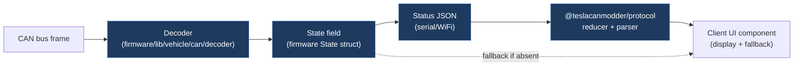

---
title: Signal Parity Matrix
description: Maps every CAN-sourced signal to its UI component, fallback value, and test coverage
category: reference
folder: reference
tags: [signals, parity, matrix, decoder]
order: 16
---

# Signal-to-UI Parity Matrix (D-14)

This document maps each CAN-bus signal that the board emits to:

1. Its `client/` UI component that displays it
2. A fallback/default value when the signal is absent
3. The unit test or test case ID that proves the signal renders correctly

---

## Legend

| Column           | Meaning                                                                  |
| ---------------- | ------------------------------------------------------------------------ |
| Signal           | Name as seen in `packages/protocol/src/` or firmware's `sendStatus` JSON |
| Client Component | Path relative to `client/src/`                                           |
| Fallback         | Value shown when signal is `undefined` / missing                         |
| Test ID          | Test file + `it(...)` description                                        |
| ✓ Parity         | Checked once the client behavior is validated                            |

---

## Powertrain Signals

| Signal                   | Client Component                           | Fallback | Test ID                                | ✓ Parity |
| ------------------------ | ------------------------------------------ | -------- | -------------------------------------- | -------- |
| `speed` (km/h)           | `DriveScreen.tsx` → speedometer arc        | `0`      | `DriveScreen.test.tsx` "renders speed" | ☐        |
| `power` (kW)             | `DriveScreen.tsx` → power badge            | `0`      | `DriveScreen.test.tsx` "renders power" | ☐        |
| `rpm`                    | `AppExperience.tsx` Signal Chart (Monitor) | `0`      | `AppExperience.test.tsx` monitor tab   | ☐        |
| `gearPosition` (P/R/N/D) | `DriveScreen.tsx` → PRND indicator         | `"P"`    | `DriveScreen.test.tsx` "shows gear"    | ☐        |

---

## Driver Assistance Signals

| Signal                           | Client Component                          | Fallback | Test ID                                | ✓ Parity |
| -------------------------------- | ----------------------------------------- | -------- | -------------------------------------- | -------- |
| `autopilotEngaged`               | `DriveScreen.tsx` → AP icon               | `false`  | `DriveScreen.test.tsx` "AP engaged"    | ☐        |
| `autopilotTier` (none/basic/fsd) | `DriveScreen.tsx` → tier label            | `"none"` | `DriveScreen.test.tsx` "AP tier label" | ☐        |
| `dasHandsOn`                     | `DriveScreen.tsx` → hands-on indicator    | `false`  | `DriveScreen.test.tsx` "DAS hands-on"  | ☐        |
| `nagKillerMode`                  | `AppExperience.tsx` Controls (nag toggle) | `"off"`  | —                                      | ☐        |

---

## Blind Spot / Safety Signals

| Signal                        | Client Component                      | Fallback | Test ID                                                                           | ✓ Parity |
| ----------------------------- | ------------------------------------- | -------- | --------------------------------------------------------------------------------- | -------- |
| `bsmLeft` (blind-spot left)   | `DriveScreen.tsx` → left BSM flash    | `false`  | `DriveScreen.test.tsx` "renders BSM severity badges and labels"                   | ☐        |
| `bsmRight` (blind-spot right) | `DriveScreen.tsx` → right BSM flash   | `false`  | `DriveScreen.test.tsx` "renders BSM severity badges and labels"                   | ☐        |
| `turnSignalLeft`              | `DriveScreen.tsx` → left arrow blink  | `false`  | `DriveScreen.test.tsx` "renders turn-signal warning badges for left/right states" | ☐        |
| `turnSignalRight`             | `DriveScreen.tsx` → right arrow blink | `false`  | `DriveScreen.test.tsx` "renders turn-signal warning badges for left/right states" | ☐        |

> **Note:** D-05 protocol/UI + firmware runtime wiring are implemented. Keep rows unsigned until on-car validation is captured.

---

## Battery & Charging Signals

| Signal                                 | Client Component                          | Fallback | Test ID                              | ✓ Parity |
| -------------------------------------- | ----------------------------------------- | -------- | ------------------------------------ | -------- |
| `soc` (State of Charge %)              | `DriveScreen.tsx` → SoC bar               | `0`      | `DriveScreen.test.tsx` "SoC bar"     | ☐        |
| `estimatedRange` (km)                  | `DriveScreen.tsx` → range readout         | `0`      | `DriveScreen.test.tsx` "range"       | ☐        |
| `batteryVoltage` (V)                   | Signal Chart — Battery tab                | `0`      | `AppExperience.test.tsx` battery tab | ☐        |
| `batteryTemp` (°C)                     | Signal Chart — Battery tab                | `0`      | `AppExperience.test.tsx` battery tab | ☐        |
| `chargeState` (idle/charging/complete) | `AppExperience.tsx` → charge status badge | `"idle"` | —                                    | ☐        |

---

## Board Configuration Signals

| Signal                     | Client Component                          | Mobile Equivalent            | Fallback   | Test ID                                  | ✓ Parity |
| -------------------------- | ----------------------------------------- | ---------------------------- | ---------- | ---------------------------------------- | -------- |
| `variant` (LEGACY/HW3/HW4) | `AppExperience.tsx` → variant badge       | `screens/ControlsScreen.tsx` | `"LEGACY"` | `AppExperience.test.tsx` "variant badge" | ☐        |
| `fsd` (FSD enabled)        | `AppExperience.tsx` Controls (FSD toggle) | `screens/ControlsScreen.tsx` | `false`    | `AppExperience.test.tsx` "FSD toggle"    | ☐        |
| `forceFsd`                 | `AppExperience.tsx` Controls              | `screens/ControlsScreen.tsx` | `false`    | —                                        | ☐        |
| `profile` (0-5)            | `AppExperience.tsx` Controls              | `screens/ControlsScreen.tsx` | `0`        | —                                        | ☐        |
| `speedOffset`              | `AppExperience.tsx` Controls              | `screens/ControlsScreen.tsx` | `0`        | —                                        | ☐        |
| `hw4Offset`                | `AppExperience.tsx` Controls              | `screens/ControlsScreen.tsx` | `0`        | —                                        | ☐        |
| `isaSpeedChime`            | `AppExperience.tsx` Controls              | `screens/ControlsScreen.tsx` | `false`    | —                                        | ☐        |
| `canClockMHz`              | `AppExperience.tsx` status strip          | `screens/ControlsScreen.tsx` | `500`      | —                                        | ☐        |

---

## CAN Frame / Monitor Signals

| Signal                         | Client Component                              | Mobile Equivalent           | Fallback            | Test ID                                         | ✓ Parity |
| ------------------------------ | --------------------------------------------- | --------------------------- | ------------------- | ----------------------------------------------- | -------- |
| Raw CAN frame stream           | `AppExperience.tsx` Monitor tab → FrameTable  | `components/FrameTable.tsx` | empty table         | `AppExperience.test.tsx` monitor tab            | ☐        |
| Frame decode (DBC name lookup) | `AppExperience.tsx` FrameTable → decoded name | `components/FrameTable.tsx` | raw hex ID          | —                                               | ☐        |
| Frame statistics (fps, buses)  | `state/frameIngestion.ts` → stats badge       | `components/FrameTable.tsx` | `{fps:0, buses:[]}` | `frameIngestion.test.ts` "selectIngestionStats" | ☐        |
| Byte-diff highlights           | FrameTable Δ toggle                           | `components/FrameTable.tsx` | hidden              | —                                               | ☐        |

---

## Completion Criteria

All rows are ✓ Parity before the M6 migration gate closes (ADR-003 §4.2).

If a Test ID cell is `—`, a test must be added before that row can be signed off.

---

## References

- `packages/protocol/src/status.ts` — canonical signal field names
- `firmware/src/io/wifi.h` — `sendStatus()` JSON builder (firmware source of truth)
- `docs/reference/can-protocol.md` — CAN ID → signal decode map
- `docs/checklists/deprecation-checklist.md` — Phase 3 uses this matrix for row-by-row verification
